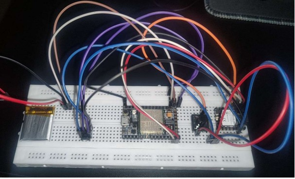

# ABHAYAM: IoT-Based Women Safety Device

This repository contains the project files for "ABHAYAM," an IoT-based women's safety device developed as a mini-project for the V semester of the Bachelor of Engineering in Computer Science. [cite_start]The project is affiliated with Visvesvaraya Technological University and was completed at K. S. Institute of Technology, Bengaluru[cite: 1, 3, 6].

## 📄 Project Report

For complete details on the project's background, design, implementation, and testing, you can view the full project report.

[View the Full Project Report (PDF)](final%20report%20mini-project.pdf)
## 📝 About the Project

[cite_start]"ABHAYAM" is an innovative safety device designed to enhance the personal security of women in emergency situations[cite: 50]. [cite_start]The core of the system is the **A9G GSM/GPS module**, which provides real-time location tracking and communication capabilities[cite: 29].

When a user triggers the **SOS button**, the device automatically:
1.  [cite_start]Retrieves the user's current GPS coordinates[cite: 52].
2.  [cite_start]Formats the location into a Google Maps link[cite: 52].
3.  [cite_start]Transmits the link via SMS to a pre-configured emergency contact[cite: 52].
4.  [cite_start]Initiates an automated voice call to the same contact for immediate communication[cite: 53].

[cite_start]The device is designed to be portable, reliable, and energy-efficient, making it suitable for wearable applications or as a standalone safety tool[cite: 54, 37].

## ⚙️ Hardware and Software

### Hardware Components
* [cite_start]**Microcontroller**: An ESP32 or ESP8266 board acts as the central processor[cite: 143].
* [cite_start]**GSM/GPS Module**: An **AI-Thinker A9G module** is used for cellular communication (SMS, calls) and GPS location tracking[cite: 105, 145].
* [cite_start]**SOS Button**: A physical push-button to trigger the emergency sequence[cite: 105, 146].
* **Power Source**: A rechargeable lithium-ion battery powers the device. [cite_start]The system includes power-saving features like a sleep mode to extend battery life[cite: 148].
* [cite_start]**Enclosure**: A compact and lightweight case for portability[cite: 150].

### Software & System Requirements
* [cite_start]**IDE**: Arduino IDE[cite: 144].
* [cite_start]**Programming Language**: C++[cite: 152].
* **System Dependencies**:
    * [cite_start]A SIM card with active SMS and calling plans must be inserted into the A9G module[cite: 111].
    * [cite_start]The device requires access to GPS satellite signals for location tracking[cite: 111].
    * [cite_start]A stable power supply is necessary for operation[cite: 112].

## 🚀 Features
* [cite_start]**SOS Alerts**: A long press on the SOS button activates emergency SMS and calls[cite: 107].
* [cite_start]**Real-Time Location Tracking**: Fetches and shares precise GPS coordinates[cite: 108].
* [cite_start]**Two-Way Communication**: Enables an automated voice call to an emergency contact[cite: 109, 31].
* [cite_start]**Low-Power Operation**: Implements sleep modes to conserve battery, with an operational time of 8-10 hours on a single charge[cite: 110, 177].
* [cite_start]**Remote Queries**: Can respond to SMS commands to get the current location or battery status[cite: 162].

## 📈 Testing & Results
The device underwent extensive testing and demonstrated high reliability:
* [cite_start]**Success Rate**: Achieved a **98% success rate** for message delivery and SOS activation in standard conditions[cite: 182].
* [cite_start]**GPS Accuracy**: Location accuracy was within **5-10 meters** in open environments[cite: 174].
* [cite_start]**Durability**: The SOS button was successfully tested for over 1000 presses[cite: 179].

## 🎓 Project Team
* [cite_start]LAKSHMI SHREE K P (1KS22CS067) [cite: 2]
* [cite_start]PUNEETH VEMURI (1KS22CS109) [cite: 2]

**Under the guidance of:**
* [cite_start]Ms. Asha Sattigeri, Assistant Professor, Department of Computer Science & Engineering, K.S.I.T. [cite: 3, 25]

## 🔮 Future Enhancements
* [cite_start]**Geofencing**: Automatically send alerts if the user crosses predefined virtual boundaries[cite: 203].
* [cite_start]**Mobile App Integration**: A companion app for real-time tracking, health monitoring, and more[cite: 206].
* [cite_start]**Law Enforcement Integration**: Directly alert local authorities with the user's location in an emergency[cite: 209].
